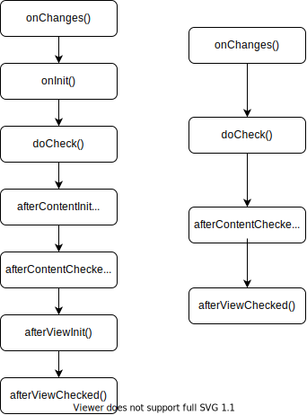

# Lifecycle hooks

## Lifecycle events

### Lifecycle event sequence

| Hook method | Purpose | Timing |
|--|:--|--|
|`ngOnChanges()`|When data-bound input properties change|before `ngOnInit()`, every data-bound input properties change|
|`ngOnInit()`|Directives, input properties and data-bound properties settled|All thing settled|
|`ngDoCheck()`|Detect changes that Angular can't|After `ngOnChanges()` `ngOnInit()`|
|`ngAfterContentInit()`|Contents and directives initialized|After the first `ngDoCheck()`|
|`ngAfterContentChecked()`|Contents and directives checked|After `ngAfterContentInit()`, every `ngDoCheck()`|
|`ngAfterViewInit()`|Views and directives initialized|After the first `ngAfterContentChecked()`|
|`ngAfterViewChecked()`|Views and directives checked|After `ngAfterViewInit`, every `ngAfterContentChecked()`|
|`ngOnDestroy()`|Unsubscribe Observables,  detach event handlers|Before Angular destroys the directive or component|

### Lifecycle event process




## `OnInit()`

*Initializing a component or directive*

> * An`ngOnInit()` is a good place for a component to fetch its initial data. 
> * The `ngOnChanges`method is first opportunity to access properties.
> * Data-bound input properties are not set until after construction.


## `OnDestroy()`

*Cleaning up on instance destruction*

*Below are the staff that won't be garbage-collected automatically.*

1. Unsubscribe from Observables and DOM events.
2. Stop Interval timers.
3. Unregister all callbacks that directive registered with global or application services.

* Notify another part of the application that the component is going away.


## General examples

### Sequence and frequency of all lifecycle events

Please reference [here](https://angular.io/guide/lifecycle-hooks#general-examples) to check the example.

### Use directives to watch the Dom

>  Use the `appSpy` directive to watch a built-in `<div>`, or watch a third party component.

*The directive using an injected `LoggerService` to log messages to the parent.*

```typescript
let nextId = 1;

// Spy on any element to which it is applied.
// Usage: <div appSpy>...</div>
@Directive({selector: '[appSpy]'})
export class SpyDirective implements OnInit, OnDestroy {
  private id = nextId++;

  constructor(private logger: LoggerService) { }

  ngOnInit() {
    this.logger.log(`Spy #${this.id} onInit`);
  }

  ngOnDestroy() {
    this.logger.log(`Spy #${this.id} onDestroy`);
  }
}

```


## `OnChanges()`

*Change detection hooks*

> **Angular calls the hook only when the value of the input property changes.**

Click [here](https://angular.io/guide/lifecycle-hooks#using-change-detection-hooks) to reference example


## `AfterViewInit(), AfterViewChecked()`

> As Angular traverses the [view hierarchy](https://angular.io/guide/glossary#view-hierarchy) during change detection, it needs to be sure that a change in a child does not attempt to cause a change in its own parent. Such a change would not be rendered properly, because of how [unidirectional data flow](https://angular.io/guide/glossary#unidirectional-data-flow) works.

*The examples illustrate how to make above changes safely.*

**`ChildViewComponent`**

```typescript
@Component({
  selector: 'app-child-view',
  template: `
    <label for="hero-name">Hero name: </label>
    <input type="text" id="hero-name" [(ngModel)]="hero">
  `
})
export class ChildViewComponent {
  hero = 'Magneta';
}
```

**`ParentViewComponent`**

```typescript
@Component({
  selector: 'app-parent-view',
  template: `
    <div>child view begins</div>
    	<span>{{ comment }}</span>
      <app-child-view></app-child-view>
    <div>child view ends</div>
  `
})

export class ParentViewComponent implements  AfterViewChecked, AfterViewInit {
  private prevHero = '';
  
  // Query for a VIEW child of type `ChildViewComponent`
  @ViewChild(ChildViewComponent) viewChild!: ChildViewComponent;
  
  public comment: string = '';
  
  constructor(private logger: LoggerService) { }

  ngAfterViewInit() {
    // viewChild is set after the view has been initialized
    this.logIt('AfterViewInit');
    this._doSomething();
  }

  ngAfterViewChecked() {
    // viewChild is updated after the view has been checked
    if (this.prevHero === this.viewChild.hero) {
      this.logIt('AfterViewChecked (no change)');
    } else {
      this.prevHero = this.viewChild.hero;
      this.logIt('AfterViewChecked');
      this._doSomething();
    }
  }
  
  // This surrogate for real business logic sets the `comment`
  private _doSomething(): void {
    const c = this.viewChild.hero.length > 10 ? "That's a long name" : '';
    if (c !== this.comment) {
      // Wait a tick because the component's view has already been checked
      this.logger.tick_then(() => this.comment = c);
    }
  }
}
```

> The **`LoggerService.tick_then()`** statement postpones the log update for one turn of the browser's JavaScript cycle, which triggers a new change-detection cycle.
>
> If the hook updates the component's data-bound `comment`property immediately, you can see that Angular throws an error.

## `AfterContentInit(), AfterContentChecked()`

Identify content projection in a template by looking for the following constructs.

* <componentTag></compontentTag>
* <ng-content></ng-content>


| Hooks                  | Concern                                                      |
| ---------------------- | ------------------------------------------------------------ |
| `ngAfterViewInit()`    | `ViewChildren ` the child components whose element tags appear *within* the component's template |
| `ngAfterContentInit()` | `ContentChildren` the child components that Angular projected into the component. |

**`ParentComponent`**

```typescript
@Component({
  selector: 'app-parent',
  template: `
  	<Child>
      <parent-content></parent-content>
    </Child>
  `
})
```

**`ChildComponent`**

<!--The <ng-content> tag is a placeholder for the external content. It tells Angular where to insert that content. --> 

> In this case, the projected content is the `<parent-content>` from the parent.

```typescript
@Component({
  selector: 'app-child',
  template: `
  	<div>
  		<ng-content></ng-content>
  	</div>
  `
})

export class ChildComponent implements AfterContentChecked, AfterContentInit {
  private prevHero: string = '';
  public comment: string = '';

  @ContentChild(ParentComponent) contentParent!: ParentComponent;

  ngAfterContentInit() {
    // contentParent is set after the content has been initialized
    this.logIt('AfterContentInit');
    this.doSomething();
  }

  ngAfterContentChecked() {
    // contentParent is updated after the content has been checked
    if (this.prevHero === this.contentParent.hero) {
      this.logIt('AfterContentChecked (no change)');
    } else {
      this.prevHero = this.contentParent.hero;
      this.logIt('AfterContentChecked');
      this.doSomething();
    }
  }
  
  private _doSomething(): void {
    const c = this.viewChild.hero.length > 10 ? "That's a long name" : '';
    if (c !== this.comment) {
      // Wait a tick because the component's view has already been checked
      this.comment = c;
    }
  }
}
```

> No need to wait for content updates
>
> This component's `doSomething()` method updates the component's data-bound `comment` property immediately. There's no need to [delay the update to ensure proper rendering](https://angular.io/guide/lifecycle-hooks#wait-a-tick).
>
> Angular calls both *AfterContent* hooks before calling either of the *AfterView* hooks. Angular completes composition of the projected content *before* finishing the composition of this component's view. There is a small window between the `AfterContent...` and `AfterView...` hooks that lets you modify the host view.

## `DoCheck()`

*An example shows how to use the `ngDoCheck()` hook and act upon changes.*

```typescript
ngDoCheck() {

  if (this.hero.name !== this.oldHeroName) {
    this.changeDetected = true;
    this.changeLog.push(`DoCheck: Hero name changed to "${this.hero.name}" from "${this.oldHeroName}"`);
    this.oldHeroName = this.hero.name;
  }

  if (this.power !== this.oldPower) {
    this.changeDetected = true;
    this.changeLog.push(`DoCheck: Power changed to "${this.power}" from "${this.oldPower}"`);
    this.oldPower = this.power;
  }

  if (this.changeDetected) {
      this.noChangeCount = 0;
  } else {
      // log that hook was called when there was no relevant change.
      const count = this.noChangeCount += 1;
      const noChangeMsg = `DoCheck called ${count}x when no change to hero or power`;
      if (count === 1) {
        // add new "no change" message
        this.changeLog.push(noChangeMsg);
      } else {
        // update last "no change" message
        this.changeLog[this.changeLog.length - 1] = noChangeMsg;
      }
  }

  this.changeDetected = false;
}
```

> If you use this hook, your implementation must be extremely lightweight or the user experience suffers.
